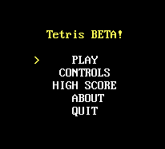
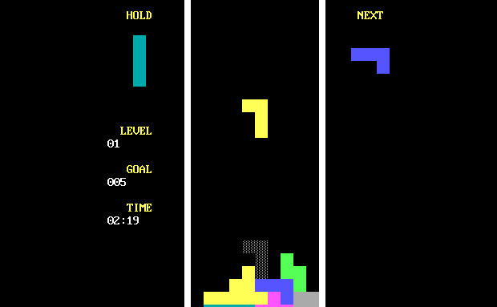

# Tetris
## Overview
Tetris is an implementation of the classical Tetris using x86 Assembly.

## Prerequisites
* DosBox
* 8086 assembler files (masm.exe and link.exe)

## Running the Project
1. Clone this project locally
2. Extract the 8086 assembler files in the same directory
3. Open DosBox and enter the following commands:
```bash
mount c: /path/to/repository
c:
masm.exe tetris.asm
link.exe tetris.obj
tetris.exe
```

You should see the title screen similar to this:



## Playing the Game

Just like normal tetris, the user places the falling blocks somewhere in the grid. Once a line is filled with blocks, the line gets cleared.



The `LEVEL` counter shows the current level of the game. The `GOAL` counter shows how many line clears are needed to proceed to the next level. The `TIME` counter shows the current time left in the level.

Each time the level increases, the falling blocks also speed up.